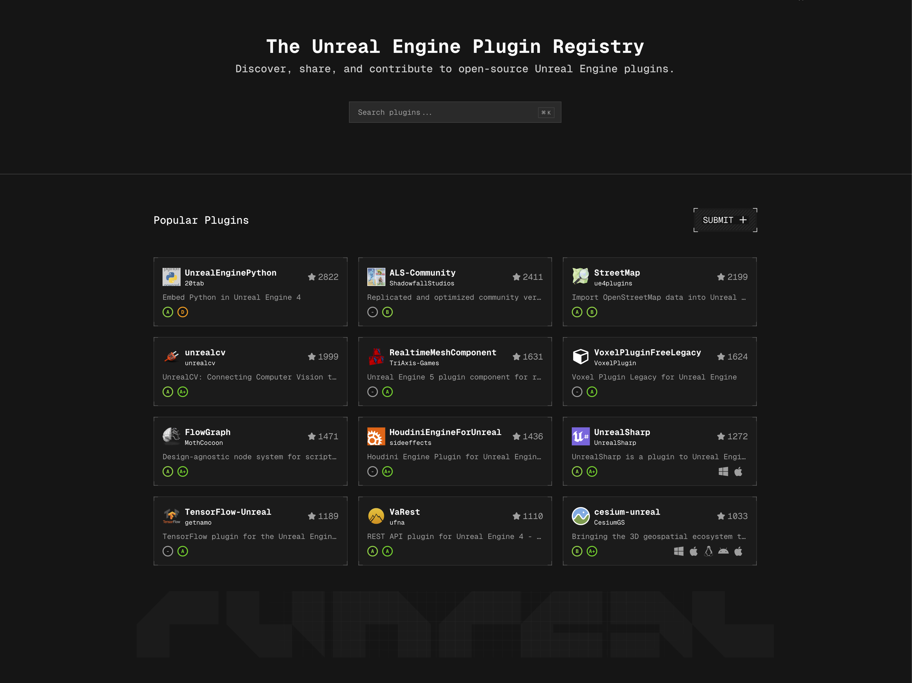

# Unreal Engine Plugin Registry
> For open source plugins

   
  <a href="https://runreal.dev">Website</a>
  ·
  <a href="https://x.com/runreal_dev">Twitter</a>
  ·
  <a href="https://discord.gg/6ZhWVU5W47">Discord</a>

### Contributing
If you would like to submit a new plugin please open an issue on Github. We are looking for actively maintained plugins with a license.
[CONTRIBUTING.md](CONTRIBUTING.md)

### License

MIT [LICENSE](LICENSE)
